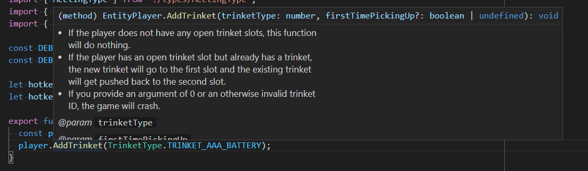

# Isaacscript, and Why It Doesn't Suck

Jill posted a [fairly log blog](https://blog.oat.zone/p/7c181fbf-99bc-40a8-b710-7384ca8d4252/) about IsaacScript. I welcome well-intentioned criticism, so I thank Jill for putting it together, which must have taken a long time.

Jill brings forth the following points:

1. TypeScript isn't a good programming language.
2. Other programming languages that transpile to Lua should have been chosen instead of TypeScript.
3. There is no operator overloading.
4. It uses a compiler, which increases overhead, and extra overhead is bad.
5. It is advertised at beginners when it should only be advertised at more advanced users.
6. Some of the features can be accomplished by extra Lua tooling.
7. IsaacScript does not work properly if you have created a symbolic link on top of your mods directory. (A symbolic link is a special redirection that Linux users sometimes do, but is rare to see in Windows.)
8. There are no TypeScript comments in the Lua output.
9. You need to cast to get around functions that return undefined.
10. It pollutes the global namespace with `__TS__` functions.
11. It adds extra transpiled functions, even if they are not used in the source code.
12. Using IsaacScript makes your mod lag more.
13. The transpiled output is hard to read.
14. Someone reading the Lua code wouldn't know that IsaacScript is used and would be confused.

Some of these points I agree with, and some are confused, so let's go through each in turn.

<br />

## 1. TypeScript isn't a good programming language.

Programming languages are tools. As programmers, once we learn a bunch of different languages, we realize that they all have different pros and cons, and that there isn't one best language. Rather, it is more about choosing the right tool for the job. And even when you choose the best tool for your particular situation, it still isn't going to be perfect, because *every programming language sucks*.

Jill pontificates on the history of JavaScript, explaining how it was created in a few short weeks. I fully agree with her: JavaScript and TypeScript suck, and there are definitely things that I would change about them. But this is missing the bigger picture. The only relevant comparison is between TypeScript and Lua - two languages that both suck. Our job here should be to point out specific things that make Lua better than TypeScript, or specific things that make TypeScript better than Lua - not just complain that TypeScript is a "bad language" in general.

Here, the closest we get to a specific criticism of TypeScript is that there is both a `==` operator and a `===` operator. For reference, the former is an "loose equality" operator, and the latter is a "strict equality" operator. The idea is that you can use whichever one best suits your needs. So let's compare that to Lua. In Lua, there is only a strict equality operator. Here, Lua appears to be at a strict disadvantage: it simply has one less operator to work with.

I'll try to steelman this point. More generally, the only feature that I am aware of that Lua has over TypeScript is coroutines, which are pretty neat. However, TypeScriptToLua allows you to create coroutines directly by just calling `coroutine.create()` in the exact same way that you would in Lua, so this isn't a win for Lua.

When we examine it from the opposite direction, TypeScript has plenty of features that Lua does not have. Beyond the obvious point of having type safety, TypeScript has switch statements, assignment operators, higher-order functions, and real ternaries, just to name a few. Yummy.

<br />

## 2. Other programming languages that transpile to Lua should have been chosen instead of TypeScript.

Jill goes on to say that MoonScript, Teal, Fennel, Amulet, and Haxe would all be better choices than TypeScript, because they are "designed to be compiled". That is a little misleading. Here, I think Jill is ignorant of how these languages work, because [all](https://github.com/leafo/moonscript/blob/b7efcd131046ed921ae1075d7c0f6a3b64a570f7/docs/command_line.md#syntax-transformer) [five](https://github.com/teal-language/tl/blob/6b46e4051eb4a73138f827387017f9bcfe1befbe/spec/parser/parser_spec.lua) [of](https://github.com/bakpakin/Fennel/blob/5b142c22c679a23f0f63873e923e16d354bcbc82/src/fennel/compiler.fnl) [these](https://github.com/ianmaclarty/amulet/blob/8fa43fcdc5e145f607ba195eb9a053b423f24655/third_party/glsl-optimizer/src/glsl/glsl_parser.yy) [languages](https://github.com/HaxeFoundation/haxe/blob/0ef19b4e282502800896ec41ad5b2fdf10a50f03/src/generators/genlua.ml) convert code to an AST (abstract syntax tree), which can then be transpiled to any language in an agnostic way. In fact, this is [exactly how TypeScriptToLua works as well](https://github.com/TypeScriptToLua/TypeScriptToLua/blob/master/src/LuaAST.ts), so there is no meaningful difference here.

In fact, before deciding on TypeScript, I did investigate all five of these options. But TypeScript stood out as the clear winner among them. TypeScript has world-class tooling and a robust ecosystem - huge swathes of the internet have shifted their codebases to TypeScript in the past few years.

On the other hand, the 5 languages that Jill recommends are tiny projects with no next-to-no adoption. To be fair, Haxe deserves a special mention here, as it has gained some traction recently with the hit browser game [Friday Night Funkin](https://github.com/ninjamuffin99/Funkin). But the size of the Haxe ecosystem pales in comparison to TypeScript. If I'm having a weird Haxe problem, the likelihood of finding a StackOverflow question or an open-source project on GitHub to help me out is orders of magnitude less likely than if I was googling for an equivalent TypeScript problem. Ecosystem matters!

Furthermore, the transpilation of TypeScriptToLua is essentially flawless and gets solid reviews from many others who have used it to code "Lua mods" for DotA2, World of Warcraft, Factorio, and others. Do any big mods written in Haxe even exist for these games? TypeScript still appears to be the clear winner in 2021.

<br />

## 3. There is no operator overloading.

Jill complains that code without operator overloading is verbose. However, this isn't a fair criticism, because any IsaacScript mod can enable operator overloading for their project by copy-pasting a new definition for a `Vector` in.

In fact, this gives you the best of both worlds: you can choose operator overloading, or you can choose the extra type safety. Either way, this is strictly an *advantage* for TypeScript over Lua, because the case where operator overloading is enabled is equivalent to the default state of affairs in Lua. (And in Lua you don't have the option to choose the other path.)

<br />

## 4. It uses a compiler, which increases overhead, and extra overhead is bad.

It is indeed true that using a compiler increases overhead. Jill is quite right to showcase here that IsaacScript significantly increases the complexity of your setup, and that should not be overlooked. I agree with her that people who are not already familiar with command-line tools and/or programming should probably not be using the tool. And extra overhead adds more things to troubleshoot when things go wrong.

But let's get a little more specific and try to quantify exactly what that overhead is.

### Installing

The time to install IsaacScript is anywhere between 1 minute (if you already know how to install things from npm) to 10 minutes (assuming you've never programmed before and you have to install Node, Git, and VSCode).

### Running

The steps to run IsaacScript are just double clicking on a shortcut, or typing a few keystrokes into a shell. Both of these can be performed in a fraction of second.

### Learning TypeScript

For those who have only programmed in Lua before, you could say that another cost would be to learn the syntax of the TypeScript programming language. Of course, many people already know both languages, and some people *only* know TypeScript, so this cost wouldn't apply to everyone.

### Transpilation

Debugging runtime errors becomes slightly more tricky because the Lua line numbers won't match up to your TypeScript line numbers. So you could consider "harder troubleshooting" as another cost of using the tool.

Thankfully, this is almost never a problem in practice, because 1) using TypeScript prevents nearly all runtime errors (that's the point of using TypeScript), and 2) the Lua code is very close to the TypeScript code, so it is trivial to find the matching line of TypeScript.

### Cost-Benefit Analysis

You can think of the cost of installing IsaacScript and learning the syntax as a one time cost, with the others as recurring costs. However, for people familiar with computers or familiar with programming, we can probably agree that these things shouldn't be a big hurdle.

As for Lua, programming mods has essentially no cost - you open up Notepad, type up some code, save the file and then boot up the game and see if it worked.

So, for people who *are* familiar with command-line tools and/or programming, the question becomes more of a cost-benefit analysis. Is it worth it to spend a few minutes to install IsaacScript and have a more complex setup in return for saving hours and hours of mod-troubleshooting? For anyone making a small mod that will only take an hour or so to make in the first place, the answer is almost unquestionably **no**. For anyone making a big mod, the answer is almost unquestionably **yes**. For anyone making medium mods, it probably depends on other factors.

<br />

## 5. It is advertised at beginners when it should only be advertised at more advanced users.

On the one hand, I think that Jill is right: adding the complexity of a compiler could be overwhelming or counterproductive for someone new to programming. But on the other hand, I think that Jill is wrong: having a compiler can be invaluable for a beginner.

Frequently, people come to the Isaac modding Discord and post code-snippets requesting help. Over and over, the root cause of many issues (maybe even most issues?) are mistyped variables, mistyped functions, or other type errors. Sometimes I notice that these troubleshooting sessions go on for *over an hour* before the root cause is discovered.

Just think about how silly that is - pouring over code, adding print statements, testing things over and over for *an entire hour* until you finally find a typo. This is the story that we see over and over again. It's a bit frustrating when you know that after a few short steps, this person could have a red squiggly line in their text editor that shows them exactly where the error is, reducing the time that it takes to solve the problem down to a *single second*.

So, the benefits for beginners can be immense. But do the benefits outweigh the costs? That is a difficult question to answer. I think I do agree with Jill that IsaacScript is best-suited for people who already know how to program TypeScript and already know how Isaac modding works. As we move further away from that side of the spectrum, things get a little more murky. There are definitely benefits of using the tool, regardless of what your skill level is, but I do take Jill's point that IsaacScript should not be recommended to everyone. If the website doesn't do a good enough job of explaining that, then it probably needs to be updated.

<br />

## 6. Some of the features can be accomplished by extra Lua tooling.

### Mouseover

Jill starts off this section by showcasing that Lua language servers provide some mouseover info, which is true. However, this is vastly inferior to IsaacScript. For example, this is a screenshot of what happens when I mouse over the `AddTrinket` method:

<br />



<br />

While every function in the game doesn't have this level of detail, a lot of them do, and tell you useful things that you would otherwise have to open up the docs to look for. This feature is fantastic and saves you a lot of time.

Jill's main point here is that it this should not be listed as a TypeScript feature, because it is possible for someone to make this happen in Lua (using something like [EmmyLua](https://github.com/EmmyLua/EmmyLua-LanguageServer)). I agree that it's *possible*, but such a framework **does not currently exist**. If it ever gets created, and it is as thorough as the IsaacScript API comments are, then when that day comes, IsaacScript will have one less feature over the competition. Until then, it's not super relevant to say that "it could be possible in Lua" without such a thing actually existing for people to use.

### API Accuracy

IsaacScript sets the definition for some problematic functions to have a type of `never`. This causes compiler errors for end-users who accidentally use those functions, which is handy.

Jill is correct in saying that this isn't an important feature. She states that you "don't really need to have something solve this", and I agree. But it's a nice bonus that you get for free when having a compiler along for the ride.

### Monolith

Jill claims that IsaacScript is a "monolith", linking a blog post that goes over the downsides of having tightly coupled software. However, she doesn't mention *how* IsaacScript is tightly coupled, she just states that it is. This is an annoying pattern that we repeatedly see in this blog.

In short, I don't think that Jill understands what the tool is doing very well. IsaacScript is objectively very modular: linting is optional, automatic mod reloading is optional, the expanded standard library is optional, and even the definitions themselves are optional. You can easily drop in your own solutions for any of these by changing a single line in the "package.json" file. Furthermore, the IsaacScript tool itself is just a convienence, and is completely optional, since you can just run TSTL yourself. So I think that this criticism misses the mark.

### Require/Include

Jill says that "there are no consequences of using `include`", but this is false. The official docs [go into more detail on why you should never use `include` without having require as a fallback](https://wofsauge.github.io/IsaacDocs/rep/tutorials/Using-Additional-Lua-Files.html), so I think that Jill is just unaware that `include` is broken in this way.

### Extra Enums

Jill points out that theoretically, extra enums are possible in Lua. I agree. But **solutions for this do not currently exist**, just like they don't exist for mouseover text. So, for practical purposes, it doesn't make much sense to point this out.

I think Jill is confused in that she is interpreting the list of IsaacScript features on the website as a list of "things that only TypeScript can do". In that interpretation, she would be right in shouting: "Hey! Lua can do some of these things do!"

Instead, I think that people should interpret the list as "things that no-one else has bothered to do as Lua", or perhaps more charitably, "things that TypeScript can do more robustly and seamlessly than could be ever possible in Lua".

### Automatic Formatting

Jill mentions that you can auto-format in Lua, which is true. In fact, the best option for Lua auto-formatting right now is [LuaFormatter](https://github.com/Koihik/LuaFormatter). I use it myself in my Lua projects, and it has a lot of great options. But I think that anyone who has used both tools would admit that LuaFormatter only has a shadow of the power that Prettier + ESLint does.

So I'd argue that listing Prettier as a feature is warranted, especially when the tooling makes using it utterly seamless. However, I don't feel strongly about this, so if people think that it would be more honest to remove it as a feature, I can.

### Automatic Linting

Jill mentions that you don't need ESLint because you can use Luacheck. But this is a little misleading.

I've used Luacheck myself for the past 5 years, and I would highly recommend it to anyone who works with Lua projects. However, the tool hasn't gotten many updates since the maintainer of the project died back in 2018. And the tool is very limited compared to what you would expect from a linter in any other language. As a fun fact, the severe limitations of Luacheck were one of the direct reasons that caused me to get frustrated enough to create IsaacScript in the first place.

On the other hand, ESLint is hands down the most popular and best linter in the world. It is actively maintained and has the ability to write custom plugins to do anything you want. The ESLint ecosystem has tons of existing rules, plugins, and even a support Discord for when things go wrong. This isn't exactly an apples to oranges comparison.

### Lua Language Servers

Jill mentions that you can achieve types in Lua with a language server. This is true, and I would highly recommend doing this for anyone working with Lua projects.

However, I think Jill should acknowledge that there is a meaningful distinction to be made between 1) types annotated on LDoc comments and validated by a linter, and 2) types embedded into the language itself.

Having all type information encoded as LDoc comments is clunky, harder to type, and difficult to ensure full coverage. But more importantly, the tooling to get this working well in the Isaac ecosystem does not currently exist. It's the same story again: when Lua types actually exist for EID, StageAPI, and the other common libraries, I'll gladly make some concessions here. But until then, it's not fair to complain that something is theoretical possible without it actually existing for people to use in their mods right now.

Furthermore, it's important to note that when types are a first class part of the language, it allows for powerful coding patterns that are just not possible with LDoc comments and a Lua language server. Consider the following code snippet:

```ts
enum Situations {
  Situation1,
  Situation2,
  Situation3,
  // Situation4, // If we uncomment this line, the program will no longer compile
}

function doThingBasedOnSituation(situation: Situation) {
  switch (situation) {
    case Situation1: {
      return "foo";
    }

    case Situation2: {
      return "bar";
    }

    case Situation3: {
      return "baz";
    }

    default: {
      ensureAllCases(situation);
      return "";
    }
  }
}
```

First, let's get past the obvious fact that Lua doesn't even have switch statements or enums, so writing this in Lua would less convenient and more prone to bugs.

More importantly, the `ensureAllCases(situation)` line leverages the type checker to iterate through every possible value for the enum. This is very useful, and helps keep your code future-safe against someone adding or removing a value from the enum.

While everyone may not appreciate the power of this, this is the kind of thing I get excited about, because I love having bug-free code. :)

### TypeScript is Not Strongly Typed

Jill claims that if you have "one trace of `any`, your code becomes unsafe", but this is misguided.

In Lua, you normally have no type safety, because nothing is typed. Alternatively, you can use a Lua language server and manually annotate types as LDoc comments. This solution is nice in that you can opt-in to as much type safety as you want. In other words, if you want to go crazy and annotate LDoc comments for every single function in the entire project, you can. Or if you want to only have certain parts of your program be type-safe, you can. You have the flexibility to do exactly what you want.

In TypeScript land, the situation is identical. TypeScript allows the `any` type as an escape hatch when you don't care what the actual type is. In this section of the blog, Jill seems to be proposing that `any` is somehow a bug, and that TypeScript shouldn't ever allow `any`. But of course, that would be quite silly, because the programmer should be empowered to do what they want. If a TypeScript programmer wants to have a completely type-safe program, then they can simply never use the `any` type in their program, or enable a lint rule that disallows it programmatically. So I think that it's the exact opposite of what Jill describes: having `any` available to use if you want is only an advantage, not a disadvantage.

<br />

## 7. IsaacScript does not work properly if you have created a symbolic link on top of your mods directory.

This is half-true. Prior to October 31st, IsaacScript would not handle the special case of end-users symlinking their mods directory to an entirely different directly. However, fixing this bug was as simple as [removing a single character](https://github.com/IsaacScript/isaacscript/pull/11/files#diff-bc9705d0f7a567399044dfc66ccc82d4d9aa1cff116842a0094d54e463c9ecbcR68), which was handily performed by Kyojo in a pull request within hours of Jill bringing up the problem in the IsaacScript Discord.

Jill seems to imply that this as a major flaw in the software, but I don't think that is very fair. Most people don't use Linux, and most people don't decide to symlink their mods directory to somewhere else.

<br />

## 8. There are no TypeScript comments in the Lua output.

I agree that it would be nice for TypeScript comments to get copied over. In fact, it's one of the open issues on the TypeScriptToLua Github. Maybe it will get implemented soon! The nice thing about TypeScriptToLua is that it is actively maintained and continues to get nice goodies added as time progresses.

Until then, I think it's worth noting that while having comments would be nice, it makes **zero practical difference**. Jill points out that without comments, troubleshooting might become really hard, but this is dead wrong. When you get a runtime error and a Lua line number, finding the matching TypeScript code is trivial because all of the Lua function names and variable names are the same.

<br />

## 9. You need to cast to get around functions that return undefined.

Jill's example attempts to show that you "have to cast" in order for some code to compile, but this is not true. Her example is instead better written like this, which requires no casting:

```ts
const players = getPlayers();
const nonCoopGhosts = players.filter((player) => !player.IsCoopGhost());
```

And if I may, let's take a quick moment to reflect on how easy to read and high-level this code is! The equivalent Lua code for doing this one simple thing would be much harder to bugfix, much harder to maintain, and so on. It's an excellent example of the power of TypeScript.

In general, I think Jill is confused about how TypeScript casting works. In my mods, I hardly ever cast anything. One notable exception is `Entity.GetData()`, since the return type on that is `Record<string, unknown>`, and it is often useful to cast that into a more specific interface to achieve even better type safety than what `Record<string, unknown>` would provide. (Notice that in this case we are casting to get *more* type safety, not less. =p)

<br />

## 10. It pollutes the global namespace with `__TS__` functions.

I agree that it would be nice for the `__TS__` functions to be local to the transpiled project. In fact, it's one of the open issues on the TypeScriptToLua Github. Maybe it will get implemented soon!

As my friends on the modding Discord server will know, I hate polluting the global namespace when it isn't required. But it's worth mentioning that until the TypeScriptToLua authors implement a "local" mode, there really isn't much practical consequence of making these functions global. The likelihood of this affecting any other mods in the ecosystem seems extremely tiny, so this feels like a pretty silly nitpick.

<br />

## 11. It adds extra transpiled functions, even if they are not used in the source code.

Jill takes issue with non-used functions getting put into the transpilation output. Admittedly, at first glance, this does appear to be a bug. However, this is not a bug, and Jill is just ignorant of how TypeScriptToLua works.

As noted in the [TypeScriptToLua documentation](https://typescripttolua.github.io/docs/configuration), the default value for the `luaLibImport` compiler option is set to `require`, which causes every polyfilled function to be included. If users instead set this to `inline`, it would match the playground behavior and only include the explicit functions that are used in the source code, which is probably how Jill would expect the software to work. So, if this is an issue for you, simply use `inline` and you are done.

For those wondering, the reason that `require` is the default over `inline` is because it provides better compilation times and doesn't increase the size of the transpiled output that much. With a big enough mod, you would probably end up using all of the transpiled functions anyway, so parsing the AST to see if the individual functions are actually being used is essentially just a waste of time.

Even if it were not possible to use the `inline` compiler flag, this criticism is still really weird. Are there any actual implications of having non-used functions in the transpiled output? Jill states that "it's not good, at ALL", but doesn't go on to say why, other than to just imply that it is "bad".

It's important to remember that as programmers, we [should only be worried about performance optimizations that are measurable](http://www.catb.org/~esr/writings/taoup/html/ch12s02.html). The time differential between the game loading a 10 KB Lua file and a 11 KB Lua file is going to be on the order of nanoseconds - it wouldn't be something that you would ever be able to meaningfully measure. Thus, worrying about this is a complete waste of time.

<br />

## 12. Using IsaacScript makes your mod lag more.

Jill speculates that using higher-order functions like `filter` will make mods more laggy than if you use a for loop. But the practical differences here are almost certainly going to be so small that they won't be measurable. This is a classic mistake made by newer programmers, summarized nicely by the legendary Donald Knuth:

> "Programmers waste enormous amounts of time thinking about, or worrying about, the speed of noncritical parts of their programs, and these attempts at efficiency actually have a strong negative impact when debugging and maintenance are considered. We should forget about small efficiencies, say about 97% of the time: premature optimization is the root of all evil.

Remember that where optimization is concerned, the [first thing that we should do is measure](https://wiki.c2.com/?RulesOfOptimizationClub). Jill idly remarks "I can't imagine how much worse this gets later", but provides no actual measurements in her blog. As for me, I've done actual benchmarks on IsaacScript code, and I am not able to detect a difference.

In the specific case that Jill outlines, we can see that `filter` incurs an extra function invocation. Realistically, this kind of thing would only make a meaningful difference if we were performing this operation millions of times per frame. This would probably never happen in an Isaac mod. It would probably never happen even with 1000 different IsaacScript mods running at the same time. As always, I am open to being wrong and welcome evidence showing otherwise. But as it stands, this seems like [a classic case of premature optimization](http://wiki.c2.com/?CategoryEvil) (which is considered evil).

Finally, I can't help but notice that this criticism in particular is not even aimed at TypeScript itself, but rather at higher-order functions. As a final nail in the coffin here, I will state that nothing prevents you from using good-old-fashioned for loops in TypeScript in exactly the same way that you would in Lua - it will be transpiled to the exact same thing!

<br />

## 13. The transpiled output is hard to read.

This is a criticism that other people have brought up before, so it's a good one to discuss. I believe that this issue is a symptom of people thinking incorrectly about what code is.

As a quick analogy, let's consider the case of C++ code. People write code in the "high-level" language of C++, which looks like this:

```c++
#include <iostream>

int main() {
    std::cout << "Hello, World";
    return 0;
}
```

Then, they run the C++ code through a compiler, which produces X86/X64 code. It looks like this:

```
          global    _start

          section   .text
_start:   mov       rax, 1
          mov       rdi, 1
          mov       rsi, message
          mov       rdx, 13
          syscall
          mov       rax, 60
          xor       rdi, rdi
          syscall

          section   .data
message:  db        "Hello, World", 10
```

As we can see, the compiled output doesn't really look much like what we started with. Rather, it is a lower level version of the code, which is naturally going to be more verbose.

For nearly all intents and purposes, we don't really care *what* the X86 code looks like, because we never need to look at it. All we care about is the source code in C++. The source code is what we read to understand how the program works. The source code is the thing that gets checked into GitHub. The source code is the thing that is going to be read by other programmers on the team.

Imagine that someone came along and told you that "a disadvantage of coding in C++ is that the compiled output is really hard to read". This would probably strike you as being quite strange. What point is there in reading the X86 code? It might as well be written in Klingon instead of X86 for all we care, since we never have to deal with it.

The situation with C++ and X86 is very similar to the situation with TypeScript and Lua. In other words, the fact that Lua is "unreadable" is almost equally as irrelevant that X86 is unreadable.

I speculate that the root of this criticism is that Lua programmers have beautiful-looking Lua code. So when they see nasty looking Lua code that is generated from a machine, they recoil. They notice that it is harder to read machine-written Lua code than it is to read human-readable code, so they consider this to be a disadvantage of the tool.

Of course, this logic only makes sense when your brain it thinking in Lua-mode. Once you start to think in TypeScript, it doesn't make a whiff of a difference what the transpiled output looks like, because all you are doing is reading the TypeScript code. Lua is **not the source code**, TypeScript is, and all that matters is the source code. So this is not something that anyone should be reasonably concerned with.

However, there is one big caveat that we have to discuss. When runtime errors occur, the Isaac log file will tell you the line of Lua that the error happened on. This means that IsaacScript coders might have to jump into the transpiled "main.lua" file from time to time to find out what went wrong. So if the Lua file is a mess, then troubleshooting runtime errors could become very difficult. In pratice though, this is **not a problem** because the generated Lua code is very close to the TypeScript code, with all of the same variable names, function names, and so on. So for any given line of Lua code, it is utterly trivial to Ctrl+Shift+F and find the corresponding line of TypeScript code.

It's also important to remember that runtime errors are **very rare** in IsaacScript land - that's the whole point of using TypeScript in the first place!

<br />

## 14. Someone reading the Lua code wouldn't know that IsaacScript is used and would be confused.

This is good feedback. As of version 1.1.30, the IsaacScript tool prints the following at the top of every transpiled main.lua file:

```lua
--[[

This Isaac mod was created with the IsaacScript tool.

The Lua code in this file was automatically generated from higher-level TypeScript code and might be
hard to read. If you want to understand how the code in this mod works, you should read the actual
TypeScript source code directly instead of trying to parse this file. Usually, the link to the
source code can be found in the mod's description on the Steam Workshop. If not, you can ask the mod
author directly if the source code is publicly available.

--]]
```

I think that this is sufficient enough for someone to not be confused when they open up a transpiled Lua file.

Jill also mentions that if the first mod she looked at was programmed in TypeScript, she would have been turned off from Isaac modding altogether, assuming that every mod in the ecosystem was also coded in TypeScript. This feels like a rather silly hypothetical to me, since it would be natural for there to be all kinds of different mods in the ecosystem.

Regardless, since [JavaScript is objectively more popular than Lua](https://www.tiobe.com/tiobe-index/), I think a more likely hypothetical is one where a newcomer is emboldened to realize that they can just use the languages that the already know instead of having to deal with Lua.

<br />

## Conclusion

Jill concludes the post with a summary:

> It leads to issues compiling the code (because, you have to remember, that's a thing you need to do!)

She doesn't say what those issues are. If you count "forgetting" to compile your TypeScript code as an issue, then that could be an issue, but that seems silly. The IsaacScript tool has been working great for over a year now, and there are no issues in compiling TypeScript code to Lua. Imagine if you told a C++ developer or a Java developer that because their languages required compilation, it could lead to "issues" with the compiled code, and that they might "forget" to compile it. That just doesn't make any sense.

> it leads to the resulting code being unreadable

The resulting code is plenty readable, with all of the same function names, variable names, and so on. With that said, if someone thinks that readability is important post-compilation, then they are confused about how this all works (see #13 above).

> it makes teamwork severely harder

Jill doesn't provide any reasons for this beyond just stating that this is the case. I think it's the opposite: working as a team is objectively easier in TypeScript due to type safety keeping everyone in sync with the API, the built-in linting rules, the built-in CI, and the seamless ability to import other team member's code.

Of course, working in Lua would be easier if everyone in the team already knew Lua and no-one knew TypeScript, but this is fairly self-evident and is a non-point.

> and its branding as the solution to all Isaac modding problems, especially to beginners, is misleading.

This is the only concluding point of Jill's that I agree with and does not seem to be a misrepresentation. If IsaacScript is branded as a solution to "every Isaac modding problem", then that is obviously a mistake, and I apologize if that appears to be the case. To be fair though, I don't think anyone is claiming that IsaacScript solves every single modding problem. The IsaacScript webpage does a pretty decent job of explaining what IsaacScript is, what situations it is good for, and who should use it. But the website is always open to improvement, and maybe it should be updated to have stronger wording to ward away beginners (see #4 above). If you want to help, I'm open to PRs.

Overall, Jill brought up a bunch of good points in this blog, but also advertised plenty of misinformation and showcased a big lack of understanding about the tool. To be fair to Jill, I don't think anyone should expect her to be an expert in IsaacScript after a day or two of messing around with it. But on the other hand, I feel like it would have been much more straightforward to simply *ask about these problems in the IsaacScript Discord* instead of writing a huge blog post, since myself or others in the Discord server could have easily disspelled these misunderstandings/falsehoods before being published.

While Jill's post had a negative tone to it, there are a few other select people in the modding community who have also had negative things to say about IsaacScript in the past (without naming names). To those detractors, hopefully this post helped alleviate some of your specific concerns!

I'd like to point out that, to my knowledge, the individuals who have said negative things about IsaacScript have not yet made a mod with it. And conversely, the people who have made a mod with IsaacScript have only good things to say about it. **I think that this is a crucial point.** It's a little frustrating, to be honest. The situation is kind of like people making fun of you because you eat some exotic food, when they haven't yet actually tried the food for themselves. If they would simply take a second out of their day to try the new food, they would near-instantaneously taste how delicious it is, and be completely embarrassed that they made fun of it without trying it for so long.

Overall, my pitch for IsaacScript remains unchanged. If you are an intermediate-to-expert coder who intends on making medium-to-large scale Isaac mods, I welcome you to give IsaacScript a try. The development experience is god-like. The proof is in the product: I virtually guarantee that after you have been coding in TypeScript for two weeks, you will never go back to coding mods the way you were before. **It's really just that simple.** If someone has negative things to say about IsaacScript without ever actually having made a mod with it, you should take what they are saying with a big grain of salt.

For those of you who don't like TypeScript for whatever reason, that's also fine. A ton of great mods have been made in Lua, and there's nothing wrong with using Lua. Jill recommends a lot of great Lua tools in her blog that I use myself in my own Lua projects. EmmyLua and Luacheck are really nice, so check those out if you already haven't.
